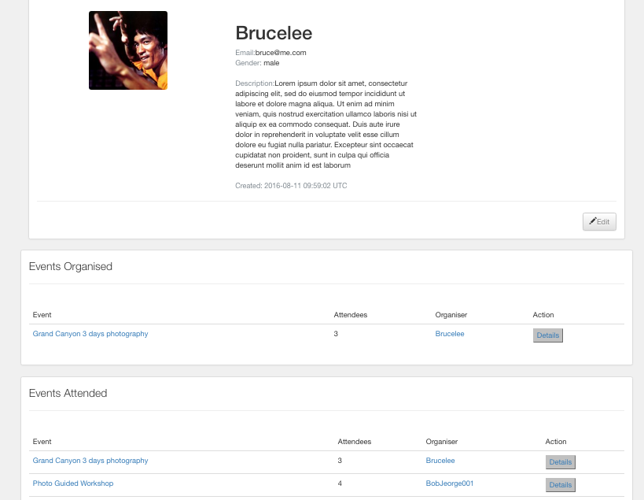

#LikeMinder Rails App

####Events Browsing

####Groups Browsing

####Event Details

######Allowing event organiser only to add activities to the timeline, they can even assign the admin of this event. Only the admin is allowed to edit the event page. 

######Allowing user to comment about the event
####User Profile

###About

A socail platform that allow people with similar interest to join a group and organise their events easily.
###The USP

The unique feature is the event page allows the admin to edit the timeline of the trip easily. In addition, being able to manage this event by assigning the organiser.
###Planning

Wireframing - Balsamiq was used to develop the project wireframes. Wireframes were designed on the smaller iphone screens to ensure responsiveness was taken into consideration.

###Project Management

Project Management is carried out by using the software Trello. To-do-list can be broken into different catagories, and it is beneficial to know which development stage you are on.

###Technologies

<li>Javascript</li>
<li>jQuery</li>
<li>Ruby On Rails</li>
<li>Bootstrap</li>
<li>SCSS</li>
<li>Devise</li>
